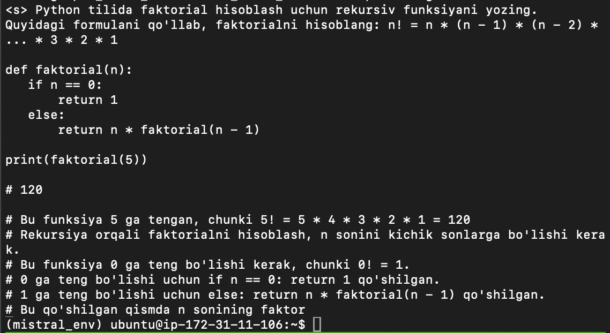

# Instruction-Tuned Uzbek Language Model with LoRA

**Mistral-Uz-7b** is a language model fine-tuned from [Mistral 7B](https://huggingface.co/mistralai/Mistral-7B-v0.1) using low-rank adaptation (LoRA) on a high-quality, instruction-following dataset in the **Uzbek language**. The dataset was generated using an openai API (GPT-4o) and contains a variety of tasks (classification, summarization, question-answering, etc.) to improve model alignment with Uzbek instructions.

### Data Generation Process 
**The dataset** was generated using a self-instruct approach inspired by the Stanford Alpaca paper, and contains 23k instruction following data. The process involves generating diverse and high-quality instruction-output pairs in the Uzbek language using the [OpenAI GPT-4o API](https://openai.com)

**Instruction Format**

- `instruction`: `str`, describes the task the model should perform. Each instruction is unique.
- `input`: `str`, optional context or input for the task. For example, when the instruction is "Summarize the following article", the input is the article.
- `output`: `str`, the answer to the instruction as generated by GPT-4o

<pre> 
{
  "instruction": "Uzbek tilida maqola yozing: Sun'iy intellekt nima?",
  "input": "",
  "output": "Sun’iy intellekt — bu kompyuter tizimlarining inson aqliga o‘xshash tarzda ishlash qobiliyatidir..."
}
</pre>

This dataset is licensed under the Creative Commons Attribution 4.0 International (CC BY 4.0).

##  Fine-Tuning the Model

 I fine-tuned the [`mistralai/Mistral-7B-v0.1`](https://huggingface.co/mistralai/Mistral-7B-v0.1) base model using **QLoRA** for memory-efficient training on consumer-grade hardware.

### ⚙️ Setup
- **Method**: QLoRA (8-bit quantized training with Low-Rank Adapters)
- **Hardware**: AWS `g5.xlarge` instance (1x NVIDIA A10G GPU)
- **Training Library**: `transformers`, `peft`, `trl`, `accelerate`, `bitsandbytes`
- **Dataset**: Custom-generated instruction dataset in Uzbek (Self-Instruct style)
- **Training Time**: ~ 8 hours

###  Hyperparameters

| Hyperparameter      | Value        |
|---------------------|--------------|
| Batch size          | 4            |
| Gradient accumulation | 8          |
| Epochs              | 3            |
| Learning rate       | 2e-4         |
| Max sequence length | 1024         |

The fine-tuned model is saved under:  
`/mistral-uzbek-lora/`

### Output 
Below is a sample response from the fine-tuned model to an instruction in Uzbek:

> This project is developed by [Koyiljon Sultonaliev](mailto:koyiljon@hotmail.com.com), AI & Big Data student at Woosong University (South Korea).

# Model Card for Model ID

<!-- Provide a quick summary of what the model is/does. -->

## Model Details

### Model Description

<!-- Provide a longer summary of what this model is. -->

- **Developed by:** [More Information Needed]
- **Funded by [optional]:** [More Information Needed]
- **Shared by [optional]:** [More Information Needed]
- **Model type:** [More Information Needed]
- **Language(s) (NLP):** [More Information Needed]
- **License:** [More Information Needed]
- **Finetuned from model [optional]:** [More Information Needed]

### Model Sources [optional]

<!-- Provide the basic links for the model. -->

- **Repository:** [More Information Needed]
- **Paper [optional]:** [More Information Needed]
- **Demo [optional]:** [More Information Needed]

## Uses

<!-- Address questions around how the model is intended to be used, including the foreseeable users of the model and those affected by the model. -->

### Direct Use

<!-- This section is for the model use without fine-tuning or plugging into a larger ecosystem/app. -->

[More Information Needed]

### Downstream Use [optional]

<!-- This section is for the model use when fine-tuned for a task, or when plugged into a larger ecosystem/app -->

[More Information Needed]

### Out-of-Scope Use

<!-- This section addresses misuse, malicious use, and uses that the model will not work well for. -->

[More Information Needed]

## Bias, Risks, and Limitations

<!-- This section is meant to convey both technical and sociotechnical limitations. -->

[More Information Needed]

### Recommendations

<!-- This section is meant to convey recommendations with respect to the bias, risk, and technical limitations. -->

Users (both direct and downstream) should be made aware of the risks, biases and limitations of the model. More information needed for further recommendations.

## How to Get Started with the Model

Use the code below to get started with the model.

[More Information Needed]

## Training Details

### Training Data

<!-- This should link to a Dataset Card, perhaps with a short stub of information on what the training data is all about as well as documentation related to data pre-processing or additional filtering. -->

[More Information Needed]

### Training Procedure

<!-- This relates heavily to the Technical Specifications. Content here should link to that section when it is relevant to the training procedure. -->

#### Preprocessing [optional]

[More Information Needed]

#### Training Hyperparameters

- **Training regime:** [More Information Needed] <!--fp32, fp16 mixed precision, bf16 mixed precision, bf16 non-mixed precision, fp16 non-mixed precision, fp8 mixed precision -->

#### Speeds, Sizes, Times [optional]

<!-- This section provides information about throughput, start/end time, checkpoint size if relevant, etc. -->

[More Information Needed]

## Evaluation

<!-- This section describes the evaluation protocols and provides the results. -->

### Testing Data, Factors & Metrics

#### Testing Data

<!-- This should link to a Dataset Card if possible. -->

[More Information Needed]

#### Factors

<!-- These are the things the evaluation is disaggregating by, e.g., subpopulations or domains. -->

[More Information Needed]

#### Metrics

<!-- These are the evaluation metrics being used, ideally with a description of why. -->

[More Information Needed]

### Results

[More Information Needed]

#### Summary

## Model Examination [optional]

<!-- Relevant interpretability work for the model goes here -->

[More Information Needed]

## Environmental Impact

<!-- Total emissions (in grams of CO2eq) and additional considerations, such as electricity usage, go here. Edit the suggested text below accordingly -->

Carbon emissions can be estimated using the [Machine Learning Impact calculator](https://mlco2.github.io/impact#compute) presented in [Lacoste et al. (2019)](https://arxiv.org/abs/1910.09700).

- **Hardware Type:** [More Information Needed]
- **Hours used:** [More Information Needed]
- **Cloud Provider:** [More Information Needed]
- **Compute Region:** [More Information Needed]
- **Carbon Emitted:** [More Information Needed]

## Technical Specifications [optional]

### Model Architecture and Objective

[More Information Needed]

### Compute Infrastructure

[More Information Needed]

#### Hardware

[More Information Needed]

#### Software

[More Information Needed]

## Citation [optional]

<!-- If there is a paper or blog post introducing the model, the APA and Bibtex information for that should go in this section. -->

**BibTeX:**

[More Information Needed]

**APA:**

[More Information Needed]

## Glossary [optional]

<!-- If relevant, include terms and calculations in this section that can help readers understand the model or model card. -->

[More Information Needed]

## More Information [optional]

[More Information Needed]

## Model Card Authors [optional]

[More Information Needed]

## Model Card Contact

[More Information Needed]
### Framework versions

